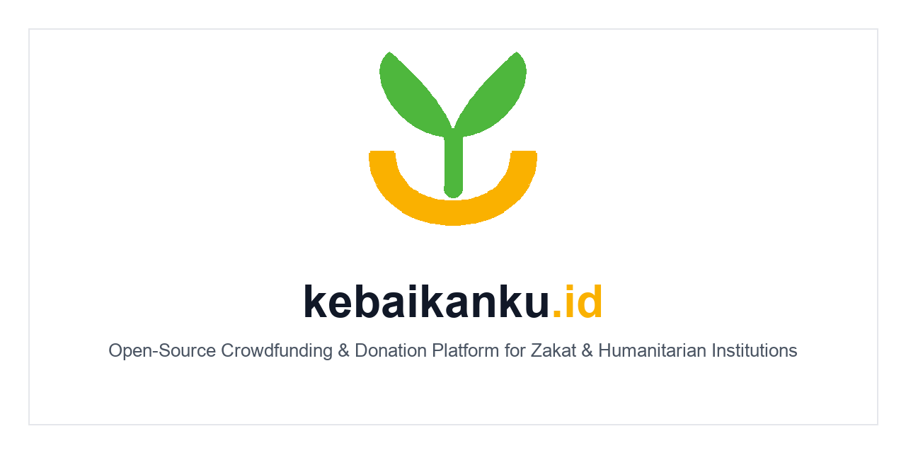

# kebaikanku.id

[](https://www.gnu.org/licenses/agpl-3.0)
[](https://kit.svelte.dev/)
[](https://go.dev/)
[](https://gorm.io/)

**kebaikanku.id** is an open-source crowdfunding and donation platform for zakat institutions, foundations, and humanitarian organizations.

The platform is designed for organizations that need donation ownership, transparent campaign operations, and low platform costs. Self-hosted deployments use a 0% compulsory platform fee model and pay only direct payment gateway costs. Managed cloud deployments may use a small platform fee to cover hosting, maintenance, support, and updates.

## Current Status

This repository is ready for a controlled production pilot after the deployment checklist is completed.

Completed:
- Go REST API with config loading, SQLite/PostgreSQL database selection, local AutoMigrate, tracked production SQL migrations, and health/readiness endpoints.
- Core domain models: `Organization`, `Campaign`, `Donor`, and `Donation`.
- Static SvelteKit landing page with Indonesian/English localization, homepage, terms, and privacy pages.
- Responsive SvelteKit dashboard with password login, signed session cookies, campaign management, encrypted Midtrans settings, uploads, and donation reconciliation.
- Midtrans Snap checkout, signed webhook processing, direct status reconciliation, and donor-facing payment result pages.
- CI for backend, both frontends, SQL migrations, and the production container image.
- Architecture, database, localization, and handover documentation.

Still required before opening the dashboard to multiple institutions:
- Multi-institution signup, roles, and account management.
- Report APIs.
- Operational monitoring and production secret provisioning.

## Product Direction

- **Self-hosted open source**: organizations host their own backend, database, and Midtrans merchant account with 0% kebaikanku.id platform fee.
- **Managed cloud SaaS**: hosted option with a low transaction-based platform fee.
- **Enterprise/white-label**: custom branding, private deployment, and implementation support under a commercial license.
- **AI roadmap**: WhatsApp-based zakat assistance and AI-generated campaign distribution reports.

## Repository Structure

```text
kebaikanku.id/
├── backend/                 # Go REST API service
├── docs/                    # Architecture, API, deployment, security, roadmap docs
├── frontend/
│   ├── landing/             # SvelteKit static landing page
│   └── dashboard/           # SvelteKit alpha operator dashboard
├── CONTRIBUTING.md
├── LICENSE
└── README.md
```

The operator dashboard lives under `frontend/dashboard` and authenticates through the backend's signed `HttpOnly` session cookie.

## Quick Start

### Backend

```bash
cd backend
cp .env.example .env
go run cmd/api/main.go
```

The backend starts on `http://localhost:8080`. Check it with:

```bash
curl http://localhost:8080/health
```

See [backend/README.md](backend/README.md) for backend setup, environment variables, database notes, and current API status.

### Production pilot

Copy `.env.production.example` to `.env.production`, set every required secret, then run:

```bash
docker compose --env-file .env.production -f docker-compose.production.yml up -d --build
curl http://127.0.0.1:8080/readyz
```

The Compose migration job must complete before the API starts. The full backup, restore, and rollback procedure is in [the deployment guide](docs/deployment.md).

### Landing Page

```bash
cd frontend/landing
npm install
npm run dev
```

The landing page starts on `http://localhost:8383` by default.

See [frontend/landing/README.md](frontend/landing/README.md) for local development, static build, localization, and Cloudflare Pages deployment notes.

## Documentation

- [System architecture](docs/architecture.md)
- [MVP scope](docs/mvp-scope.md)
- [Database architecture](docs/database.md)
- [API contract](docs/api.md)
- [Deployment guide](docs/deployment.md)
- [Security notes](docs/security.md)
- [Payment gateway design](docs/payment-gateway.md)
- [Localization strategy](docs/localization.md)
- [Roadmap](docs/roadmap.md)
- [Project handover](docs/handover.md)
- [Developer onboarding & runbook](docs/onboarding.md)
- [Landing page static deployment checklist](docs/deployment_checklist.md)

## Payment Gateway

The current payment gateway is **Midtrans**. The API creates Snap checkouts, verifies notification signatures, reconciles transaction status directly, and counts successful donations idempotently.

Xendit can be evaluated later behind a provider interface after the donation and callback lifecycle is stable.

## License

This project is dual-licensed:

1. **AGPL-3.0** for the open-source community edition. If you modify and host this platform as a network service, you must disclose your modifications under the same license.
2. **Commercial Enterprise License** for white-labeling, proprietary modifications, private deployments, and official implementation support.

See [LICENSE](LICENSE) and [CONTRIBUTING.md](CONTRIBUTING.md) for contribution terms.
