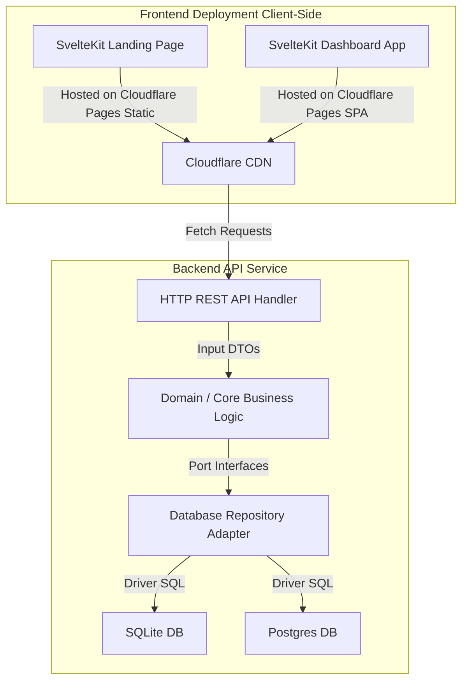

# System Architecture

This document describes the high-level architecture and file organization of the **kebaikanku.id** platform.

---

## 🏗️ Core Architectural Principles

To ensure that the platform remains **modular**, **maintainable**, and **enterprise-ready**, we apply a **Hexagonal (Clean) Architecture** pattern to the backend, while separating our frontend concerns into distinct, optimized deployment units.



### 1. Separation of Concerns
*   **Static Landing Page**: Pre-rendered at build time. Deployed directly to Cloudflare Pages for instant global loads at 0 USD hosting cost.
*   **Web App Dashboard**: A Single Page Application (SPA) compiled from SvelteKit, communicating via REST API to the Go backend.
*   **Go Backend**: A stateless API server handling authentication, transaction routing, Midtrans payment callbacks, and data management.

### 2. Hexagonal (Clean) Architecture in Go
In the Go backend, we isolate core business domains from infrastructure dependencies (database engines, framework libraries, payment APIs):
*   **Domain (Core)**: Declares entity structures (e.g., Campaign, Donation) and interfaces (Ports) for persistence and external actions. Does not import anything outside the Go standard library.
*   **Handlers (Adapters)**: Implement the REST routes using a router (e.g., Chi or Fiber), parse JSON inputs, validate requests, and call the Domain service.
*   **Repositories (Adapters)**: Implement database query logic using GORM. Conforms to interfaces declared in the domain layer.
*   **Infrastructure (Adapters)**: Implement external services such as Midtrans, mailing/SMS/WhatsApp integrations, and future AI gateway calls.

---

## 📁 Repository Directory Layout

```
kebaikanku.id/
├── backend/                   # Go REST API Service
│   ├── cmd/
│   │   └── api/               # Entrypoint of the Go API server
│   ├── internal/
│   │   ├── config/            # Environment variable parsing and global config
│   │   ├── database/          # Database connection builder (GORM, SQLite/Postgres)
│   │   ├── domain/            # Current core models: organization, campaign, donor, donation
│   │   ├── handler/           # Planned REST handlers
│   │   ├── repository/        # Planned repository implementations
│   │   ├── service/           # Planned business services
│   │   └── middleware/        # Planned Auth JWT and route-specific middleware
│   ├── go.mod
│   └── go.sum
├── frontend/
│   ├── landing/               # SvelteKit static site for landing page
│   │   ├── src/
│   │   │   ├── routes/        # Pages (+page.svelte, /terms, /privacy)
│   │   │   └── lib/           # UI components, locales, utilities
│   │   └── vite.config.js     # Uses SvelteKit with @sveltejs/adapter-static
│   └── dashboard/             # Planned SvelteKit SPA site for institution dashboard
│       ├── src/
│       │   ├── routes/        # App interface (Campaign setup, payments, users)
│       │   └── lib/           # Auth store, API fetchers
│       └── vite.config.js     # Planned static SPA build with fallback to index.html
└── docs/                      # Architectural & design documents
```

---

## 🌐 Communication Protocol

All communication between the Frontend clients and the Go Backend is done over **HTTPS REST APIs** using **JSON** as the payload serialization format:

*   **Authentication**: The single pilot administrator signs in with `ADMIN_PASSWORD`; the API issues a signed, time-limited `HttpOnly` session cookie. The dashboard never stores an operator token in browser storage.
*   **CORS**: Go Backend implements secure Cross-Origin Resource Sharing rules allowing requests from landing page and dashboard domains.
*   **Status Codes**: Standard HTTP status codes are used (`200 OK`, `201 Created`, `400 Bad Request`, `401 Unauthorized`, `403 Forbidden`, `404 Not Found`, `500 Internal Server Error`).
*   **Error Format**: Consistent JSON error responses:
    ```json
    {
      "success": false,
      "error": {
        "code": "VALIDATION_FAILED",
        "message": "Field 'amount' must be greater than zero"
      }
    }
    ```

---

## 💳 Payment Boundary

Midtrans is the first payment gateway for the MVP. The backend should own:

*   Creating local pending donations before calling Midtrans.
*   Creating Midtrans Snap/Core API transactions.
*   Verifying Midtrans payment notifications.
*   Mapping Midtrans statuses to internal donation statuses.
*   Updating donation status and campaign totals idempotently.

Future providers such as Xendit should be added behind a provider interface after the Midtrans lifecycle is stable.
